# SubEquipe_02

## Escopo
* Fluxo de infrações no aplicativo `Detran/DF Digital`

## Modelagem Estática

### Participantes no Foco_01
| Nome do Membro | Modelagem |
| --- | --- |
| Matheus Pinheiro | Diagrama de Componentes |

### Metodologia do Foco_01
O diagrama de componentes criado leva como base os fluxos de `Solicitação de Boleto`, `Visualização de Boleto` e `Solicitar Descontos de 20% e 40%`, os quais ja haviam sido analisados na entrega 1.

Foi utilizada a plataforma [Lucidchart](https://lucid.app) para a modelagem, seguindo as normas encontradas na [UML 2.5](https://www.uml-diagrams.org/component-diagrams.html).

 
<strong>Diagrama de componentes — versão 1.0</strong>

### Diagrama de Componentes
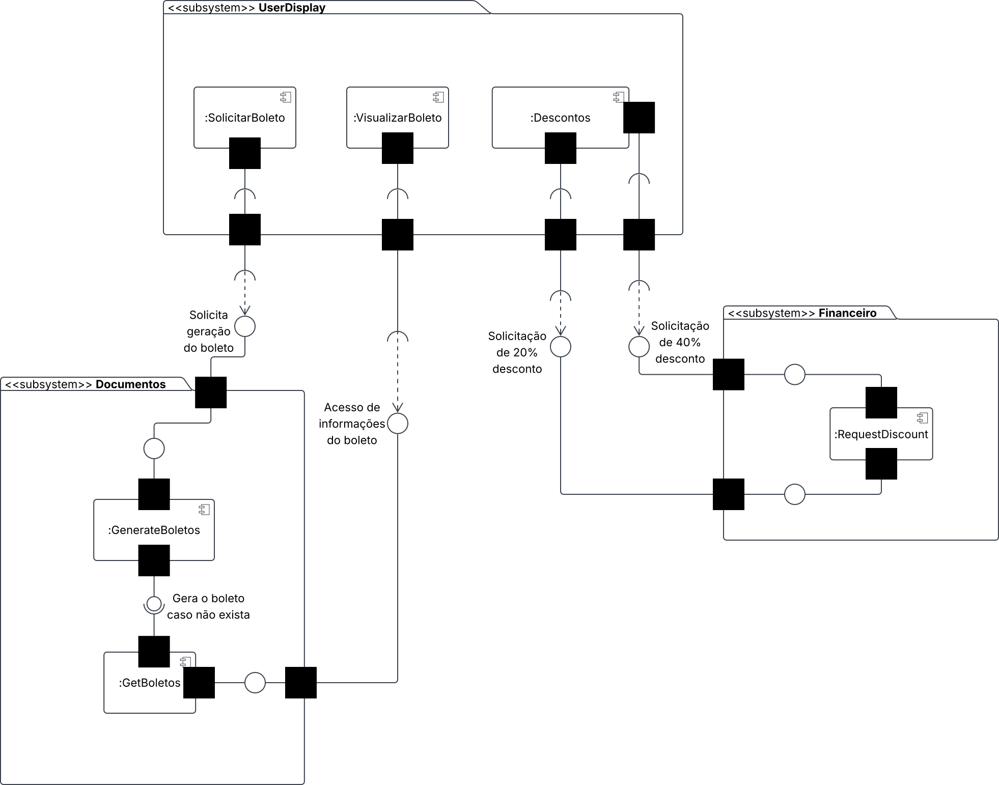
Autor: Matheus Pinheiro

 
<strong>Diagrama de componentes — versão 1.1</strong>

### Diagrama de Componentes - Versão 1.1

* Atualização: 
  * Adição da camada de persistência como recomendado durante as aulas

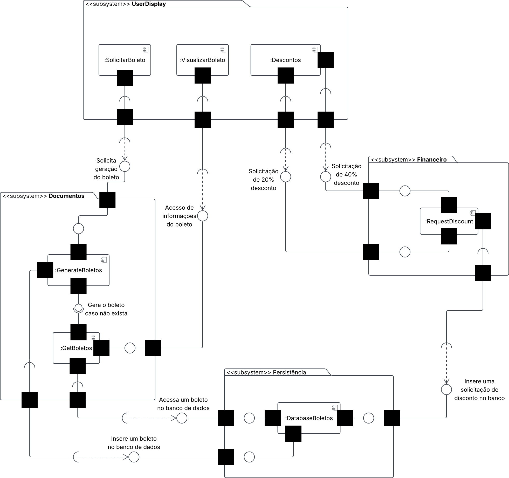

Autor: Matheus Pinheiro

#
## Modelagem Dinâmica

### Participantes no Foco_02
| Nome do Membro | Modelagem |
| --- | --- |
| Matheus Pinheiro | Diagramas de Atividades |

### Metodologia do Foco_02
O diagrama de Atividades criado leva como base os fluxos de `Solicitação de Boleto` e `Visualização de Boleto`, os quais ja haviam sido analisados na entrega 1.

Foi utilizada a plataforma [Lucidchart](https://lucid.app) para a modelagem, seguindo as normas encontradas na [UML 2.5](https://www.uml-diagrams.org/activity-diagrams.html).

### Diagrama de Atividades
#### Solicitação de Boletos
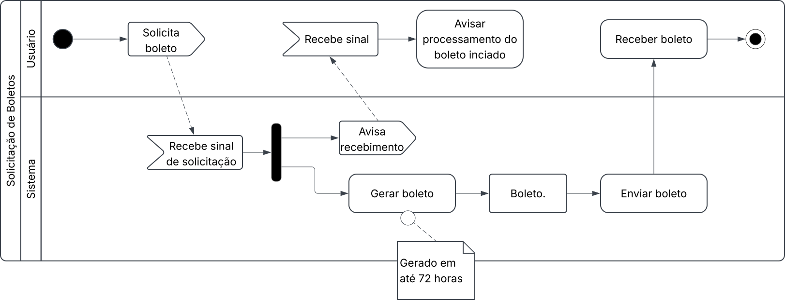
Autor: Matheus Pinheiro

#### Visualização de Boletos
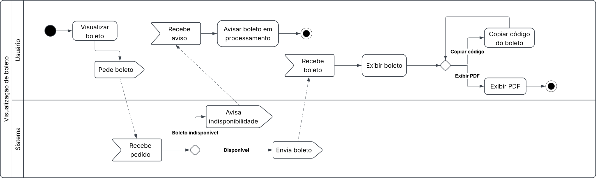
Autor: Matheus Pinheiro

#### Simbologia utilizada
| Símbolo | Descrição |
| --- | --- |
| 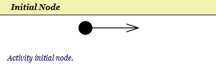 | Ponto de início do fluxo; |
| 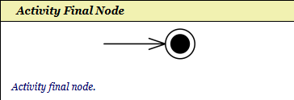 | Ponto de término do fluxo; |
| 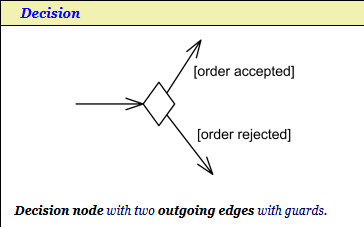 | Redireciona o fluxo dependendo de uma condição escrita na seta |
| 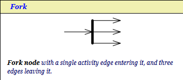 | Paralelisa o fluxo |
| 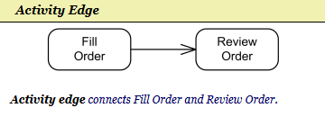 | Mostra o fluxo entre atividades |
| 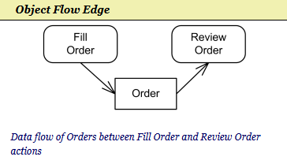 | Mostra o fluxo entre atividade e objeto |
| 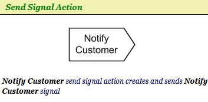 | Envia um sinal |
| 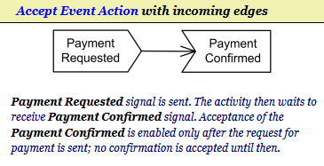 | Recebe um sinal |
| 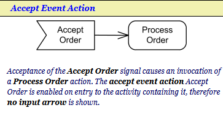 | Recebimento de um sinal provoca uma atividade |
| 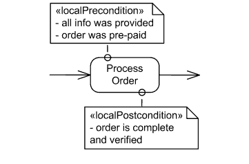 | Foi utilizado o símbolo de pré/pós-condição para simbolizar o comentário |

Fonte: [UML 2.5](https://www.uml-diagrams.org/activity-diagrams-reference.html)

#
## IA Generativa

### Participantes no Foco_03
| Nome do Membro | Lições Aprendidas | Uso da IA Generativa (SENSO CRÍTICO) |
| --- | ---  | --- |
| Matheus Pinheiro | De todos os modelos gerados, inclusives os não apresentados nesta apresentação, nenhum conseguiu seguir a UML de forma 100% integra e ao mesmo tempo utilizar as notação corretas (alguns seguiam a UML mas de forma muito simples, somente usando início, fim, decisão e atividade no diagrama de atividades por exemplo), apesar de todos os erros, ainda pode ser útil para gerar um rascunho inicial, ou ter uma ideia de como inciar, uma forma encontrada de melhorar os diagramas gerados, foi enviar outros diagramas do mesmo sistema, como por exemplo mostrando o BPMN ja existente, ele conseguiu gerar um diagrama de atividades melhor, embora fosse necessário especifiacar alguns simbolos que queria que ele utilizasse, como sinais, paralelismo, objetos, etc | Geração de um novo modelo de atividade e componentes pela IA, Pesquisa de como criar o menu colapsável usado no versionamento dos diagramas |

### Diagramas gerado por IA
| Diagrama | Modelo utilizado | Prompt | Resultado |
| --- | --- | --- | --- |
| Atividades | Claude Sonnet 5 - médio | "Sabendo que estou analisando o aplicativo do detran DF, mais especificamente as funções de infrações, Crie Diagramas de atividades em uma plataforma que segue a UML 2.5 para representar o fluxo de Visualização e Solicitação de boletos." | Matheus Pinheiro - No geral pode ser usado como um rascunho ou base, mas ainda comete muitos erros e deve ser revisado e corrigido, erros: Simbolos de inicio e fim de fluxo fora do padrão, formatação confusa, a visualização do boleto não deixa claro o fluxo inteiro (abrir PDF, copiar código) e nem possiveis condições, como acessar um boleto ainda em geração, falta do paralelismo que avisa o recebimento do pedido de geração do boleto, ausência de outras simbologias da UML como sinais e objetos |
| Componentes | GPT-5.6 Luna | "Sabendo que estou analisando o aplicativo do detran DF, mais especificamente as funções de infrações, Crie Diagramas de componentes no draw.io, seguindo a UML 2.5 para representar o fluxo de Visualização e Solicitação de boletos e descontos de 20% e 40% (todos em um unico arquivo)." | Matheus Pinheiro - Dentro dos pontos positivos, se pode notar a criação de subsistemas, componentes e até mesmo da camada de persistencia, no entanto muito da notação ficou sobreposta, de forma a impossibilitar a leitura, além disso a nomenclatura dos componentes e subsistemas estão erradas e há ausência das portas e interfaces  |

#### Atividade: Visualização de Boletos:
Autor: Claude

#### Atividade: Solicitação de Boletos:
Autor: Claude

#### Diagrama de Componentes:
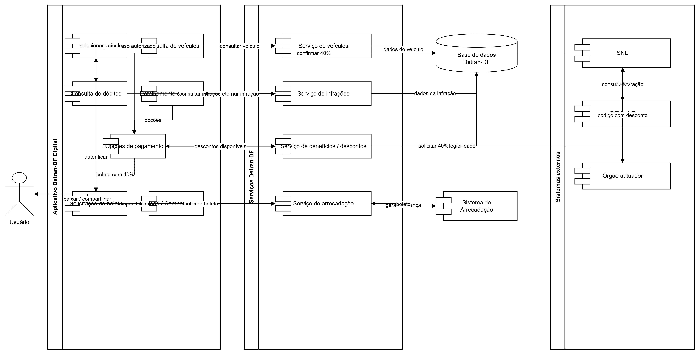
Autor: ChatGPT

#
## Versionamentos
|Nome do Membro | Contribuição | Data
| --- | --- | --- |
| Matheus Pinheiro | Insere da minha [entrega individual](/Base/Relatorios/Subequipe_02/Matheus/1.1.2.Entrega_Matheus.md) | 18/09/2026 |

--

## Referências

### Materiais de consulta
- UML DIAGRAMS. *UML Activity Diagrams Reference*. Disponível em: https://www.uml-diagrams.org/activity-diagrams-reference.html. Acesso em: 18 set. 2026.

- UML DIAGRAMS. *UML Component Diagrams*. Disponível em: https://www.uml-diagrams.org/component-diagrams.html. Acesso em: 18 set. 2026.

- UNIVERSIDADE DE BRASÍLIA. *FCTE_ARQ-DSW: Disciplina de Arquitetura & Desenho de Software*. Disponível em: https://sites.google.com/view/unb-fcte-arqdsw. Acesso em: 18 set. 2026.

### Ferramentas utilizadas

- LUCID SOFTWARE INC. *Lucid*. Disponível em: https://lucid.app/. Acesso em: 18 set. 2026.
- OPENAI. *ChatGPT*. Disponível em: https://chatgpt.com/. Acesso em: 18 set. 2026.
- ANTHROPIC. *Claude*. Disponível em: https://claude.ai/. Acesso em: 18 set. 2026.