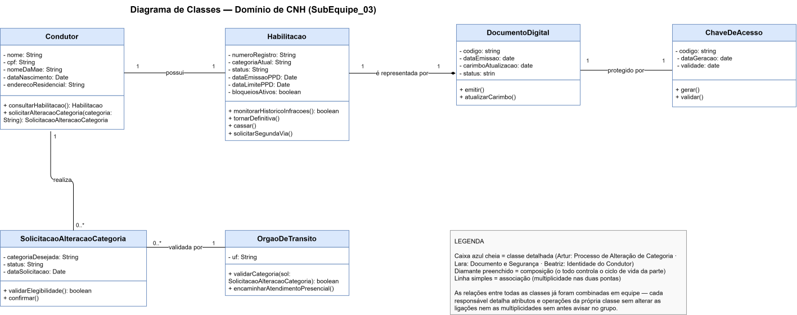
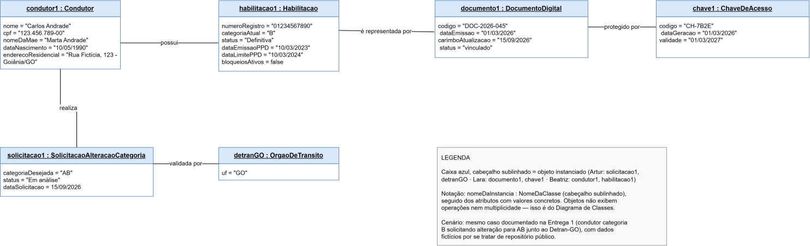
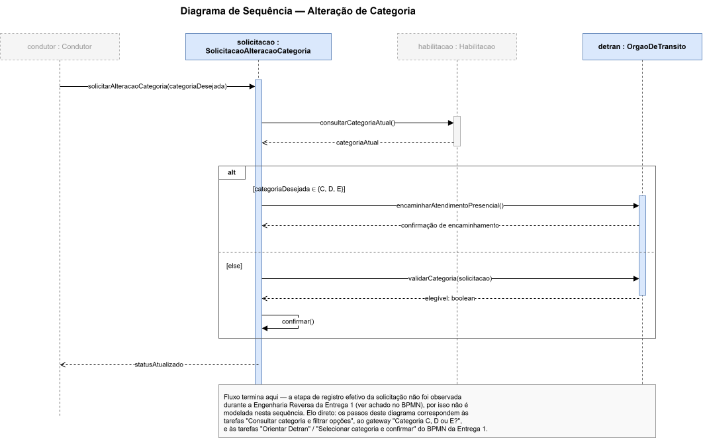
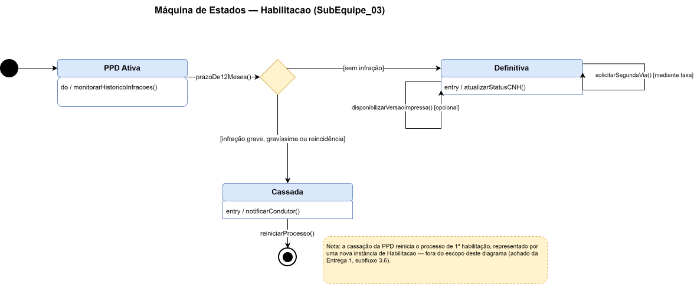

# SubEquipe_03

**Escopo:** Modelagem UML do domínio de CNH (continuidade da Entrega 1)
**Elo com a Entrega 1:** este relatório projeta, em Engenharia Direta, o sistema cuja estrutura foi recuperada por Engenharia Reversa no relatório da Entrega 1 (SubEquipe_03)

**Divisão por agrupamento de classes:**

| Agrupamento | Classes | Responsável |
|---|---|---|
| Processo de Alteração de Categoria | `SolicitacaoAlteracaoCategoria`, `OrgaoDeTransito` | Artur Fernandes |
| Documento e Segurança | `DocumentoDigital`, `ChaveDeAcesso` | [COLEGA B] |
| Identidade do Condutor | `Condutor`, `Habilitacao` | [COLEGA C] |

---

## Focos do Relatório:

### FOCO_01: Modelagem Estática

Entrega Mínima: um modelo estático, na notação UML.

### Participantes no Foco_01

| Nome do Membro |
|---|
| Artur Fernandes |
| [COLEGA B] |
| [COLEGA C] |

### Metodologia do Foco_01

<!-- RESPONSÁVEL: [COLEGA B] -->

[COMPLETAR: como o trabalho no Diagrama de Classes e no de Objetos foi dividido e conduzido — reuniões, como compartilharam o arquivo `.drawio`, decisões discutidas em conjunto]

### Elo com a Entrega 1

Cada classe deste modelo deriva diretamente de um achado documentado na Entrega 1:

| Classe | Origem na Entrega 1 |
|---|---|
| `Condutor` | Ator representado no Rich Picture |
| `Habilitacao` | Dados observados na tela "Informações do Condutor" |
| `SolicitacaoAlteracaoCategoria` | Fluxo modelado no diagrama BPMN |
| `OrgaoDeTransito` | Gateway do BPMN — decisão de encaminhamento ao Detran |
| `DocumentoDigital` | Tela da CNH digital, com carimbo de atualização |
| `ChaveDeAcesso` | Achado da credencial adicional exigida para remoção do documento |

Esse elo não é apenas ilustrativo: como a Entrega 1 já havia levantado as regras de negócio por observação direta do sistema real, o modelo estático desta entrega parte de comportamento verificado, e não de suposição.

### Diagrama de Classes

**Decisões de modelagem**

<!-- RESPONSÁVEL: Artur -->

As classes `SolicitacaoAlteracaoCategoria` e `OrgaoDeTransito` representam o agrupamento "Processo de Alteração de Categoria". Duas decisões de modelagem merecem justificativa:

**Por que associação, e não composição, entre `Condutor` e `SolicitacaoAlteracaoCategoria`.** Uma solicitação de alteração de categoria não precisa do condutor para continuar existindo enquanto registro histórico — mesmo que a conta do condutor fosse encerrada, o registro da solicitação permaneceria válido para fins de auditoria do órgão de trânsito. Por isso a relação é associação simples, e não composição: as duas classes têm ciclos de vida independentes.

**Por que a multiplicidade `0..*` entre `Condutor` e `SolicitacaoAlteracaoCategoria`.** Um condutor pode nunca ter solicitado alteração de categoria (`0`) ou pode ter solicitado mais de uma vez ao longo da vida da habilitação, inclusive solicitações negadas ou canceladas (`*`). Fixar a multiplicidade em `1` estaria incorreto, porque o achado da Entrega 1 mostrou que a solicitação pode ser recusada sem alterar a habilitação vigente — ou seja, o histórico de tentativas não se resume a uma só.

**Por que a relação entre `SolicitacaoAlteracaoCategoria` e `OrgaoDeTransito` é `0..*` para `1`.** Um órgão de trânsito valida muitas solicitações ao longo do tempo, mas cada solicitação individual é validada por um único órgão — o achado da Entrega 1 mostrou que a UF de emissão determina qual órgão processa o pedido, então não haveria sentido em uma solicitação ser validada por mais de um órgão simultaneamente.

### Diagrama de Objetos

**Cenário instanciado**

<!-- RESPONSÁVEL: Artur -->

O cenário reproduz o mesmo caso observado na Entrega 1: um condutor fictício, habilitado na categoria B, solicitando alteração para a categoria AB junto ao órgão de trânsito de Goiás. Os valores dos atributos de `solicitacao1` (`categoriaDesejada = "AB"`, `status = "Em análise"`) e de `detranGO` (`uf = "GO"`) são fictícios, mas coerentes com o comportamento real observado — a categoria B foi de fato a categoria vigente registrada no achado da Entrega 1, e as combinações disponíveis para alteração (ACC+B ou AB) foram confirmadas por observação direta do aplicativo.

**Justificativa da escolha dos diagramas**

<!-- RESPONSÁVEL: [COLEGA C] -->

[COMPLETAR: por que Diagrama de Classes + Diagrama de Objetos como par estático, com referência à literatura]

**Responsáveis por agrupamento**

| Agrupamento | Classes | Responsável |
|---|---|---|
| Processo de Alteração de Categoria | `SolicitacaoAlteracaoCategoria`, `OrgaoDeTransito` | Artur Fernandes |
| Documento e Segurança | `DocumentoDigital`, `ChaveDeAcesso` | [COLEGA B] |
| Identidade do Condutor | `Condutor`, `Habilitacao` | [COLEGA C] |

---

### FOCO_02: Modelagem Dinâmica

Entrega Mínima: um modelo dinâmico, na notação UML.

### Participantes no Foco_02

| Nome do Membro |
|---|
| Artur Fernandes |
| [COLEGA B] |
| [COLEGA C] |

### Metodologia do Foco_02

<!-- RESPONSÁVEL: [COLEGA B] -->

[COMPLETAR: como a modelagem dinâmica foi conduzida pela equipe]

### Diagrama de Sequência — Alteração de Categoria

<!-- RESPONSÁVEL: Artur -->

| Diagrama | Responsável |
|---|---|
| Diagrama de Sequência — Alteração de Categoria | Artur Fernandes |

**Elo com o BPMN da Entrega 1**

O diagrama de sequência detalha, em nível de troca de mensagens entre objetos, exatamente o trecho do BPMN da Entrega 1 que envolve o agrupamento sob minha responsabilidade:

| Etapa do BPMN (Entrega 1) | Correspondência no Diagrama de Sequência |
|---|---|
| Tarefa "Consultar categoria e filtrar opções" | Mensagens `consultarCategoriaAtual()` e seu retorno, entre `solicitacao` e `habilitacao` |
| Gateway "Categoria C, D ou E?" | Fragmento combinado `alt`, com as duas condições de guarda |
| Tarefa "Orientar Detran" (ramo "sim" do BPMN) | Mensagem `encaminharAtendimentoPresencial()`, primeiro operando do `alt` |
| Tarefa "Selecionar categoria e confirmar" (ramo "não" do BPMN) | Mensagens `validarCategoria()` e `confirmar()`, segundo operando do `alt` |

Optei por usar o fragmento `alt` em vez de dois diagramas de sequência separados por ser a forma correta, na notação UML, de representar uma decisão exclusiva dentro de uma única interação — o equivalente, em sequência, ao gateway exclusivo que já havíamos usado no BPMN.

Uma diferença deliberada em relação ao BPMN: a tarefa "Registrar solicitação (não observado)", que no BPMN da Entrega 1 já havia sido marcada como não observada, não aparece neste diagrama de sequência. Não modelei uma mensagem para uma etapa cujo comportamento não foi verificado, pelo mesmo motivo que levou à marcação equivalente no BPMN — representar uma etapa não observada como se fosse comportamento confirmado seria inventar dado onde a Engenharia Reversa não chegou.

### Máquina de Estados — DocumentoDigital

<!-- RESPONSÁVEL: [COLEGA B] -->

| Diagrama | Responsável |
|---|---|
| Máquina de Estados — DocumentoDigital | [COLEGA B] |

[COMPLETAR: descrição dos estados e achados de modelagem]

### Máquina de Estados — Habilitacao

<!-- RESPONSÁVEL: [COLEGA C] -->

| Diagrama | Responsável |
|---|---|
| Máquina de Estados — Habilitacao | [COLEGA C] |

[COMPLETAR: descrição dos estados e achados de modelagem]

### Recursos de notação UML empregados

<!-- RESPONSÁVEL: [COLEGA C] -->

| Recurso | Onde foi utilizado | Justificativa |
|---|---|---|
| Associação com multiplicidade | Diagrama de Classes | [preencher] |
| Composição | Diagrama de Classes (`Habilitacao` ◆— `DocumentoDigital`) | [preencher] |
| Fragmento combinado `alt` | Diagrama de Sequência | Representa a mesma decisão exclusiva do gateway do BPMN da Entrega 1, agora em nível de troca de mensagens entre objetos |
| Mensagem para si mesmo (self-message) | Diagrama de Sequência (`confirmar()`) | Representa uma validação interna do próprio objeto `solicitacao`, sem envolver outro participante |
| Estado com condição de guarda | Máquinas de Estados | [preencher] |

---

### FOCO_03: IA Generativa

Entrega Mínima: pontos de vista de cada membro da equipe sobre as lições aprendidas e uso da IA Generativa.
TODOS DEVEM PARTICIPAR!

### Participantes no Foco_03

| Nome do Membro | Lições Aprendidas | Uso da IA Generativa (SENSO CRÍTICO) |
|---|---|---|
| Artur Fernandes | Entendi a diferença entre associação, composição e agregação — não é regra decorada, é sobre quem controla o ciclo de vida de quem. Modelei `Habilitacao` ◆— `DocumentoDigital` como composição porque o documento digital não existe sem a habilitação; já `Condutor` — `SolicitacaoAlteracaoCategoria` ficou como associação simples, porque a solicitação sobrevive como registro histórico mesmo que o condutor deixasse de existir no sistema. Também aprendi a usar fragmento `alt` no Diagrama de Sequência para representar uma decisão exclusiva entre objetos — é o mesmo raciocínio do gateway do BPMN, só que em outro nível de abstração. | Usei IA para montar a estrutura inicial dos arquivos `.drawio` a partir das decisões que eu já tinha tomado sobre classes, relações e o fluxo de mensagens. O ponto crítico foi a multiplicidade: a primeira versão gerada colocou `1` entre `Condutor` e `SolicitacaoAlteracaoCategoria`, o que está errado — teria que ser `0..*`, porque o achado da Entrega 1 mostrou que uma solicitação pode ser recusada sem o condutor ter feito nenhuma outra, e ele também pode nunca ter solicitado nada. Só a comparação com o que a gente já tinha observado no app revelou o erro. Isso reforçou que multiplicidade não é detalhe estético do diagrama — é uma afirmação sobre a regra de negócio, e só quem observou o sistema real sabe se ela está certa. |
| [COLEGA B] | [preencher] | [preencher] |
| [COLEGA C] | [preencher] | [preencher] |

---

## Versionamentos

| Nome do Membro | Contribuição | Data |
|---|---|---|
| Artur Fernandes | 1. Estrutura do relatório; 2. Diagrama de Classes (agrupamento Processo de Alteração de Categoria); 3. Diagrama de Objetos (cenário de alteração de categoria); 4. Diagrama de Sequência com fragmento alt; 5. Decisões de modelagem e elo com o BPMN da Entrega 1; 6. Checklist de qualidade dos modelos; 7. Ponto de vista sobre uso de IA Generativa | 17/09/2026 |
| [COLEGA B] | [preencher] | [DD/MM/AAAA] |
| [COLEGA C] | [preencher] | [DD/MM/AAAA] |

---

## Referências

<!-- RESPONSÁVEL: [COLEGA C] — conferir formatação ABNT -->

OBJECT MANAGEMENT GROUP. **Unified Modeling Language (UML) Specification, Version 2.5.1.** OMG, 2017.

BOOCH, G.; RUMBAUGH, J.; JACOBSON, I. **The Unified Modeling Language User Guide.** 2. ed. Boston: Addison-Wesley, 2005.

FOWLER, M. **UML Distilled: A Brief Guide to the Standard Object Modeling Language.** 3. ed. Boston: Addison-Wesley, 2003.

PRESSMAN, R. S.; MAXIM, B. R. **Engenharia de Software: uma abordagem profissional.** 8. ed. Porto Alegre: AMGH, 2016.

SOMMERVILLE, I. **Engenharia de Software.** 10. ed. São Paulo: Pearson, 2018.
