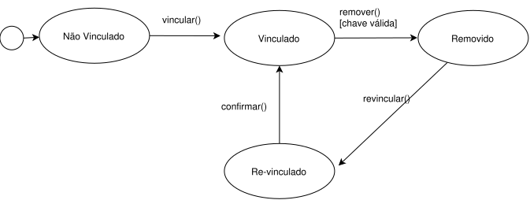

# SubEquipe_03

**Escopo:** Modelagem UML do domínio de CNH (continuidade da Entrega 1) 

**Elo com a Entrega 1:** este relatório projeta, em Engenharia Direta, o sistema cuja estrutura foi recuperada por Engenharia Reversa no relatório da Entrega 1 (SubEquipe_03)

**Divisão por agrupamento de classes:**

| Agrupamento | Classes | Responsável |
|---|---|---|
| Processo de Alteração de Categoria | `SolicitacaoAlteracaoCategoria`, `OrgaoDeTransito` | Artur Fernandes |
| Documento e Segurança | `DocumentoDigital`, `ChaveDeAcesso` | Lara Souza Mota |
| Identidade do Condutor | `Condutor`, `Habilitacao` | Beatriz Santos |

---

## Focos do Relatório:

### FOCO_01: Modelagem Estática

Entrega Mínima: um modelo estático, na notação UML.

### Participantes no Foco_01

| Nome do Membro |
|---|
| Artur Fernandes |
| Lara Souza Mota |
| Beatriz Santos |

### Metodologia do Foco_01

A divisão do trabalho estático seguiu o agrupamento de classes definido em equipe: cada responsável detalhou suas próprias classes no mesmo arquivo `.drawio` de Diagrama de Classes, compartilhado entre os três integrantes. Como as classes estão interligadas (por exemplo, a composição entre `Habilitacao` e `DocumentoDigital`), adotamos uma regra de bastão para evitar conflito de edição simultânea: quem fosse mexer avisava no grupo antes, baixava a versão mais recente, editava, exportava e avisava que havia liberado o arquivo para o próximo.

Concluído o Diagrama de Classes, o mesmo princípio de arquivo compartilhado e regra de bastão foi aplicado ao Diagrama de Objetos: cada integrante instanciou as próprias classes seguindo um único cenário fictício combinado em equipe (condutor de categoria B solicitando alteração para AB junto ao Detran-GO), com valores fictícios coerentes entre si.

### Elo com a Entrega 1

Cada classe deste modelo deriva diretamente de um achado documentado na Entrega 1:

| Classe | Origem na Entrega 1 |
|---|---|
| `Condutor` | Ator representado no Rich Picture |
| `Habilitacao` | Dados observados na tela "Informações do Condutor" |
| `SolicitacaoAlteracaoCategoria` | Fluxo modelado no diagrama BPMN |
| `OrgaoDeTransito` | Gateway do BPMN — decisão de encaminhamento ao Detran |
| `DocumentoDigital` | Tela da CNH digital, com carimbo de atualização |
| `ChaveDeAcesso` | Achado da credencial adicional exigida para remoção do documento |

Esse elo não é apenas ilustrativo: como a Entrega 1 já havia levantado as regras de negócio por observação direta do sistema real, o modelo estático desta entrega parte de comportamento verificado, e não de suposição.

### Diagrama de Classes

**Decisões de modelagem**

<!-- RESPONSÁVEL: Artur -->

As classes `SolicitacaoAlteracaoCategoria` e `OrgaoDeTransito` representam o agrupamento "Processo de Alteração de Categoria". Duas decisões de modelagem merecem justificativa:

**Por que associação, e não composição, entre `Condutor` e `SolicitacaoAlteracaoCategoria`.** Uma solicitação de alteração de categoria não precisa do condutor para continuar existindo enquanto registro histórico — mesmo que a conta do condutor fosse encerrada, o registro da solicitação permaneceria válido para fins de auditoria do órgão de trânsito. Por isso a relação é associação simples, e não composição: as duas classes têm ciclos de vida independentes.

**Por que a multiplicidade `0..*` entre `Condutor` e `SolicitacaoAlteracaoCategoria`.** Um condutor pode nunca ter solicitado alteração de categoria (`0`) ou pode ter solicitado mais de uma vez ao longo da vida da habilitação, inclusive solicitações negadas ou canceladas (`*`). Fixar a multiplicidade em `1` estaria incorreto, porque o achado da Entrega 1 mostrou que a solicitação pode ser recusada sem alterar a habilitação vigente — ou seja, o histórico de tentativas não se resume a uma só.

**Por que a relação entre `SolicitacaoAlteracaoCategoria` e `OrgaoDeTransito` é `0..*` para `1`.** Um órgão de trânsito valida muitas solicitações ao longo do tempo, mas cada solicitação individual é validada por um único órgão — o achado da Entrega 1 mostrou que a UF de emissão determina qual órgão processa o pedido, então não haveria sentido em uma solicitação ser validada por mais de um órgão simultaneamente.

<!-- RESPONSÁVEL: Beatriz Santos -->

As classes `Condutor` e `Habilitacao` representam o agrupamento "Identidade do Condutor". Três decisões de modelagem merecem justificativa:

**Por que associação, e não composição, entre `Condutor` e `Habilitacao`.** Optamos por associação simples (multiplicidade `1` para `1`) porque, embora todo condutor habilitado possua exatamente uma habilitação vigente, o próprio achado da Entrega 1 sobre a CNH Definitiva mostra que o objeto `Habilitacao` pode ser extinto por cassação e reiniciado como um novo processo de 1ª habilitação. Assim, o ciclo de vida da habilitação não é inteiramente controlado pelo `Condutor` da mesma forma que `DocumentoDigital` é controlado por `Habilitacao`. Reservamos a composição para o par em que essa dependência de existência é inequívoca.

**Por que os atributos `status`, `dataEmissaoPPD` e `dataLimitePPD` ficam em `Habilitacao`, e não em `Condutor`.** O achado da Entrega 1 sobre o subfluxo 3.6 (CNH Definitiva) mostra que o sistema monitora um período de 12 meses e um status que evolui de PPD para Definitiva ou é cassado, em função de infrações. Esse é um comportamento do documento de habilitação em si, não da pessoa: por isso os atributos que sustentam a Máquina de Estados apresentada no Foco 2 ficam em `Habilitacao`.

**Por que os dados sensíveis (`cpf`, `nomeDaMae`, `enderecoResidencial`) ficam em `Condutor`, e não em `Habilitacao`.** A Entrega 1 registrou, como tensão do Rich Picture, que a tela de informações do condutor mascara nome e CPF, enquanto a tela de histórico de emissões exibe os mesmos dados sem máscara, são atributos de identificação da pessoa, reaproveitados por diferentes telas do fluxo de habilitação, e não um dado específico de um processo de habilitação. Modelá-los em `Condutor` evita duplicar o mesmo dado sensível em mais de uma classe do domínio.

### Diagrama de Objetos

**Cenário instanciado**

<!-- RESPONSÁVEL: Artur -->

O cenário reproduz o mesmo caso observado na Entrega 1: um condutor fictício, habilitado na categoria B, solicitando alteração para a categoria AB junto ao órgão de trânsito de Goiás. Os valores dos atributos de `solicitacao1` (`categoriaDesejada = "AB"`, `status = "Em análise"`) e de `detranGO` (`uf = "GO"`) são fictícios, mas coerentes com o comportamento real observado — a categoria B foi de fato a categoria vigente registrada no achado da Entrega 1, e as combinações disponíveis para alteração (ACC+B ou AB) foram confirmadas por observação direta do aplicativo.

**Justificativa da escolha dos diagramas**

<!-- RESPONSÁVEL: Beatriz Santos -->

Escolhemos o par Diagrama de Classes e Diagrama de Objetos porque eles respondem a perguntas diferentes e complementares sobre o mesmo domínio. O Diagrama de Classes opera no nível de tipo: define quais classes existem, quais atributos e operações cada uma tem e como elas se relacionam em geral (OMG, 2017; BOOCH; RUMBAUGH; JACOBSON, 2005). O Diagrama de Objetos opera no nível de instância: é uma fotografia do sistema em um momento específico, com valores concretos no lugar de tipos (FOWLER, 2003). Um diagrama de classes correto pode, ainda assim, esconder um erro de multiplicidade que só aparece ao tentar instanciar um cenário real. Por isso mantivemos os dois diagramas amarrados ao mesmo cenário fictício (condutor de categoria B solicitando alteração para AB junto ao Detran-GO): o Diagrama de Objetos funciona como verificação de que a estrutura definida no Diagrama de Classes de fato sustenta o caso de uso levantado por Engenharia Reversa na Entrega 1, e não um caso hipotético desconectado da observação direta do aplicativo.
**Responsáveis por agrupamento**

| Agrupamento | Classes | Responsável |
|---|---|---|
| Processo de Alteração de Categoria | `SolicitacaoAlteracaoCategoria`, `OrgaoDeTransito` | Artur Fernandes |
| Documento e Segurança | `DocumentoDigital`, `ChaveDeAcesso` | Lara Souza Mota |
| Identidade do Condutor | `Condutor`, `Habilitacao` | Beatriz Santos |

---

### FOCO_02: Modelagem Dinâmica

Entrega Mínima: um modelo dinâmico, na notação UML.

### Participantes no Foco_02

| Nome do Membro |
|---|
| Artur Fernandes |
| Lara Souza Mota |
| Beatriz Santos |

### Metodologia do Foco_02

Diferente da modelagem estática, na modelagem dinâmica cada responsável ficou com um diagrama de tipo diferente, Diagrama de Sequência, Máquina de Estados do `DocumentoDigital` e Máquina de Estados da `Habilitacao`, cada um em arquivo `.drawio` próprio, o que evitou qualquer risco de conflito de edição simultânea. A divisão de qual diagrama caberia a cada integrante foi combinada em equipe antes de começar, seguindo o mesmo agrupamento de classes já definido no Foco 1.

Cada diagrama dinâmico foi modelado a partir de um achado específico já levantado na Entrega 1, de modo que as condições de guarda e as transições representassem comportamento observado no aplicativo, e não suposição, o detalhamento de cada achado e sua tradução para a notação UML aparece na seção de cada diagrama, a seguir.

### Diagrama de Sequência — Alteração de Categoria

<!-- RESPONSÁVEL: Artur -->

| Diagrama | Responsável |
|---|---|
| Diagrama de Sequência — Alteração de Categoria | Artur Fernandes |

**Elo com o BPMN da Entrega 1**

O diagrama de sequência detalha, em nível de troca de mensagens entre objetos, exatamente o trecho do BPMN da Entrega 1 que envolve o agrupamento sob minha responsabilidade:

| Etapa do BPMN (Entrega 1) | Correspondência no Diagrama de Sequência |
|---|---|
| Tarefa "Consultar categoria e filtrar opções" | Mensagens `consultarCategoriaAtual()` e seu retorno, entre `solicitacao` e `habilitacao` |
| Gateway "Categoria C, D ou E?" | Fragmento combinado `alt`, com as duas condições de guarda |
| Tarefa "Orientar Detran" (ramo "sim" do BPMN) | Mensagem `encaminharAtendimentoPresencial()`, primeiro operando do `alt` |
| Tarefa "Selecionar categoria e confirmar" (ramo "não" do BPMN) | Mensagens `validarCategoria()` e `confirmar()`, segundo operando do `alt` |

Optei por usar o fragmento `alt` em vez de dois diagramas de sequência separados por ser a forma correta, na notação UML, de representar uma decisão exclusiva dentro de uma única interação — o equivalente, em sequência, ao gateway exclusivo que já havíamos usado no BPMN.

Uma diferença deliberada em relação ao BPMN: a tarefa "Registrar solicitação (não observado)", que no BPMN da Entrega 1 já havia sido marcada como não observada, não aparece neste diagrama de sequência. Não modelei uma mensagem para uma etapa cujo comportamento não foi verificado, pelo mesmo motivo que levou à marcação equivalente no BPMN — representar uma etapa não observada como se fosse comportamento confirmado seria inventar dado onde a Engenharia Reversa não chegou.

### Máquina de Estados — DocumentoDigital

| Diagrama | Responsável |
|---|---|
| Máquina de Estados — DocumentoDigital | Lara Souza Mota |

O `DocumentoDigital` percorre quatro estados: `Não Vinculado` (estado inicial, documento ainda não associado a uma habilitação), `Vinculado` (após o evento `vincular()`), `Removido` (após `remover()`) e `Re-vinculado` (após `revincular()`, retornando a `Vinculado` mediante `confirmar()`).

A transição mais relevante do ponto de vista de modelagem é `remover() [chave válida]`: a condição de guarda entre colchetes expressa diretamente o achado da Entrega 1 de que a remoção do documento exige uma credencial adicional a `ChaveDeAcesso`. Sem essa guarda, o diagrama sugeriria que qualquer solicitação de remoção seria aceita incondicionalmente, o que não corresponde ao comportamento observado no sistema real.

### Máquina de Estados — Habilitacao

<!-- RESPONSÁVEL: Beatriz Santos -->

| Diagrama | Responsável |
|---|---|
| Máquina de Estados — Habilitacao | Beatriz Santos |

**Elo com o BPMN da Entrega 1**

Modelei o ciclo de vida da habilitação com base no achado que eu mesma documentei na Entrega 1 sobre o subfluxo 3.6 (CNH Definitiva): o processo parte de uma PPD ativa, monitora o histórico de infrações durante 12 meses e, ao final do período, verifica a existência de infração grave, gravíssima ou reincidência.

A `Habilitacao` percorre três estados principais: `PPD Ativa` (estado inicial, com a atividade contínua `monitorarHistoricoInfracoes()` durante os 12 meses previstos), `Cassada` (alcançado quando a verificação encontra infração grave, gravíssima ou reincidência) e `Definitiva` (alcançado quando a verificação não encontra nenhuma dessas condições). A transição de `PPD Ativa` para o pseudo-estado de decisão usa o evento `prazoDe12Meses()`; a partir dali, as duas transições de saída carregam as condições de guarda `[infração grave, gravíssima ou reincidência]` e `[sem infração]`, mutuamente exclusivas, o que justifica o uso de um pseudo-estado de decisão (*choice*) em vez de duas transições soltas a partir do mesmo estado (OMG, 2017).

A transição mais relevante do ponto de vista de modelagem é a saída de `Cassada`: o achado da Entrega 1 registra que, quando a PPD é cassada, "o condutor é notificado e o processo de 1ª habilitação deve ser reiniciado". Modelei a notificação como uma ação de entrada (`entry / notificarCondutor()`) no próprio estado `Cassada`, e o reinício do processo como uma transição para o estado final, não como um laço de volta a `PPD Ativa`, porque reiniciar a 1ª habilitação, pelo que a Entrega 1 observou, não é uma repetição do mesmo objeto `Habilitacao`, e sim um novo processo; o estado final da máquina representa exatamente essa distinção (OMG, 2017; BOOCH; RUMBAUGH; JACOBSON, 2005).

### Recursos de notação UML empregados

<!-- RESPONSÁVEL: Beatriz Santos -->

| Recurso | Onde foi utilizado | Justificativa |
|---|---|---|
| Associação com multiplicidade | Diagrama de Classes | Expressa quantas instâncias de cada classe podem se relacionar em cada extremidade — por exemplo, `1` para `1` entre `Condutor` e `Habilitacao` (todo condutor habilitado tem exatamente uma habilitação vigente) contra `0..*` entre `Condutor` e `SolicitacaoAlteracaoCategoria` (o achado da Entrega 1 mostrou que uma solicitação pode ser recusada sem impedir novas tentativas). Sem a multiplicidade, o diagrama não distinguiria uma regra de negócio obrigatória de uma opcional (OMG, 2017) |
| Composição | Diagrama de Classes (`Habilitacao` ◆— `DocumentoDigital`) | O documento digital não tem existência própria fora da habilitação que o gero, se a habilitação deixa de existir (por exemplo, ao ser cassada e substituída por um novo processo, como modelado na Máquina de Estados), o documento digital associado perde sentido junto com ela. É a mesma distinção que levou a não usar composição entre `Condutor` e `Habilitacao` (BOOCH; RUMBAUGH; JACOBSON, 2005). |
| Fragmento combinado `alt` | Diagrama de Sequência | Representa a mesma decisão exclusiva do gateway do BPMN da Entrega 1, agora em nível de troca de mensagens entre objetos |
| Mensagem para si mesmo (self-message) | Diagrama de Sequência (`confirmar()`) | Representa uma validação interna do próprio objeto `solicitacao`, sem envolver outro participante |
| Estado com condição de guarda | Máquinas de Estados (`Habilitacao`: `[infração grave, gravíssima ou reincidência]` / `[sem infração]`) | O achado da Entrega 1 sobre o subfluxo 3.6 descreve exatamente essa verificação como o critério que decide entre cassação e habilitação definitiva. Sem a guarda, o diagrama sugeriria uma bifurcação não determinística, o que não corresponde à regra de negócio observada. |

---

### FOCO_03: IA Generativa

Entrega Mínima: pontos de vista de cada membro da equipe sobre as lições aprendidas e uso da IA Generativa.
TODOS DEVEM PARTICIPAR!

### Participantes no Foco_03

| Nome do Membro | Lições Aprendidas | Uso da IA Generativa (SENSO CRÍTICO) |
|---|---|---|
| Artur Fernandes | Entendi a diferença entre associação, composição e agregação — não é regra decorada, é sobre quem controla o ciclo de vida de quem. Modelei `Habilitacao` ◆— `DocumentoDigital` como composição porque o documento digital não existe sem a habilitação; já `Condutor` — `SolicitacaoAlteracaoCategoria` ficou como associação simples, porque a solicitação sobrevive como registro histórico mesmo que o condutor deixasse de existir no sistema. Também aprendi a usar fragmento `alt` no Diagrama de Sequência para representar uma decisão exclusiva entre objetos — é o mesmo raciocínio do gateway do BPMN, só que em outro nível de abstração. | Usei IA para montar a estrutura inicial dos arquivos `.drawio` a partir das decisões que eu já tinha tomado sobre classes, relações e o fluxo de mensagens. O ponto crítico foi a multiplicidade: a primeira versão gerada colocou `1` entre `Condutor` e `SolicitacaoAlteracaoCategoria`, o que está errado — teria que ser `0..*`, porque o achado da Entrega 1 mostrou que uma solicitação pode ser recusada sem o condutor ter feito nenhuma outra, e ele também pode nunca ter solicitado nada. Só a comparação com o que a gente já tinha observado no app revelou o erro. Isso reforçou que multiplicidade não é detalhe estético do diagrama — é uma afirmação sobre a regra de negócio, e só quem observou o sistema real sabe se ela está certa. |
| Lara Souza Mota | Entendi na prática a diferença entre associação e composição: `Habilitacao` ◆— `DocumentoDigital` é composição porque o documento não tem existência própria fora da habilitação que o gerou, enquanto `DocumentoDigital` `ChaveDeAcesso` é associação simples, já que a chave pode ser gerada, revogada e regerada independentemente do ciclo de vida do documento. Também entendi que, numa Máquina de Estados, os retângulos representam estados , não ações e que uma condição de guarda entre colchetes não é detalhe visual, é uma regra de negócio anexada à transição. No Diagrama de Objetos, aprendi que instâncias não exibem operações nem multiplicidade  só atributos com valores concretos e o nome da instância sublinhado  isso é do Diagrama de Classes, não do de Objetos. | A IA ajudou a estruturar rapidamente os atributos, tipos e operações das minhas duas classes, e a montar um primeiro rascunho de como as transições da Máquina de Estados deveriam se conectar. Mas as instruções para desenhar no draw.io nem sempre bateram com a realidade da ferramenta: por diversas vezes a IA descreveu a direção de uma seta de um jeito, e ao verificar visualmente no editor a seta estava desenhada ao contrário precisei checar manualmente, seta por seta, comparando a ponta do triângulo com o sentido esperado, em vez de confiar de olho fechado na descrição textual. |
| Beatriz Santos |  Máquina de Estados me obrigou a decidir se a cassação da PPD deveria ser um laço de volta a PPD Ativa ou uma saída para um estado final. Reli meu próprio achado da Entrega 1 sobre o subfluxo 3.6 e percebi que o texto já respondia a essa dúvida: fala em "reiniciar o processo de 1ª habilitação", não em repetir o mesmo processo, ou seja, é um novo objeto, não uma transição de volta. Aprendi que um pseudo-estado de decisão só se justifica quando as condições de guarda das transições de saída são de fato mutuamente exclusivas, e que vale a pena verificar isso contra o comportamento observado, em vez de assumir pela conveniência do desenho. | Usei IA para montar a estrutura inicial da Máquina de Estados a partir da descrição em texto do meu próprio achado da Entrega 1. A primeira versão gerada modelou a cassação como uma transição de volta ao estado PPD Ativa, o que eu verifiquei estar errado por ter documentado o subfluxo 3.6 na Entrega 1, o texto falava em reiniciar o processo, não em repetir o estado. Isso reforçou a mesma lição que já havia tirado ao investigar o Vale Carta na Entrega 1: não basta a IA gerar algo plausível, é preciso comparar com o que foi de fato observado no aplicativo antes de aceitar. |

---

## Versionamentos

| Nome do Membro | Contribuição | Data |
|---|---|---|
| Artur Fernandes | 1. Estrutura do relatório; 2. Diagrama de Classes (agrupamento Processo de Alteração de Categoria); 3. Diagrama de Objetos (cenário de alteração de categoria); 4. Diagrama de Sequência com fragmento alt; 5. Decisões de modelagem e elo com o BPMN da Entrega 1; 6. Checklist de qualidade dos modelos; 7. Ponto de vista sobre uso de IA Generativa | 17/09/2026 |
| Lara Souza Mota | 1. Detalhamento das classes DocumentoDigital e ChaveDeAcesso no Diagrama de Classes; 2. Instanciação das mesmas classes no Diagrama de Objetos; 3. Máquina de Estados do DocumentoDigital, com condição de guarda na remoção; 4. Ponto de vista sobre uso de IA Generativa | 17/09/2026 |
| Beatriz Santos | 1. Detalhamento das classes Condutor e Habilitacao no Diagrama de Classes; 2. Instanciação das mesmas classes no Diagrama de Objetos; 3. Máquina de Estados da Habilitacao, com pseudo-estado de decisão e condições de guarda baseadas no achado da Entrega 1 sobre a CNH Definitiva; 4. Justificativa da escolha do par Diagrama de Classes + Diagrama de Objetos; 5. Preenchimento da tabela de recursos de notação UML; 6. Revisão e reordenação alfabética das Referências; 7. Ponto de vista sobre uso de IA Generativa | 17/09/2026 |

---

## Referências

<!-- RESPONSÁVEL: Beatriz Santos -->

BOOCH, G.; RUMBAUGH, J.; JACOBSON, I. **The Unified Modeling Language User Guide.** 2. ed. Boston: Addison-Wesley, 2005.

FOWLER, M. **UML Distilled: A Brief Guide to the Standard Object Modeling Language.** 3. ed. Boston: Addison-Wesley, 2003.

HAREL, D. Statecharts: a visual formalism for complex systems. **Science of Computer Programming**, v. 8, n. 3, p. 231-274, 1987.

OBJECT MANAGEMENT GROUP. **Unified Modeling Language (UML) Specification, Version 2.5.1.** OMG, 2017.

PRESSMAN, R. S.; MAXIM, B. R. **Engenharia de Software: uma abordagem profissional.** 8. ed. Porto Alegre: AMGH, 2016.

SOMMERVILLE, I. **Engenharia de Software.** 10. ed. São Paulo: Pearson, 2018.

