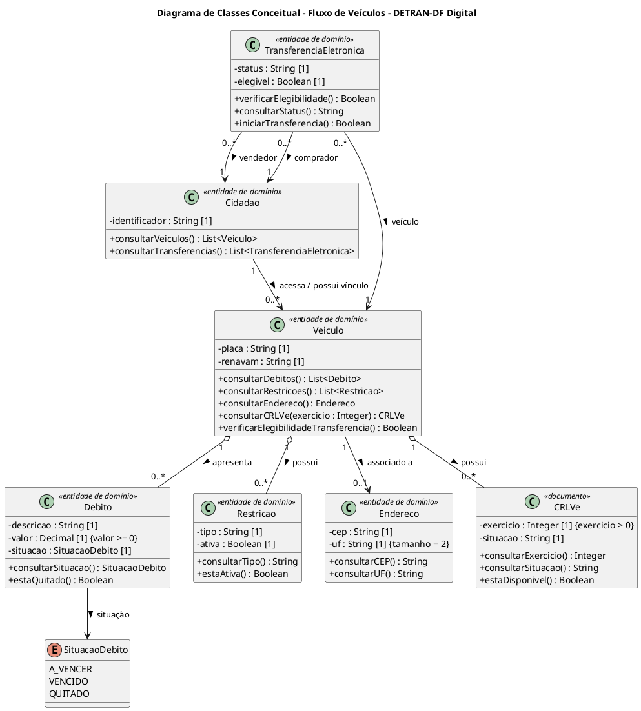

# FOCO 01: Modelagem Estática — Fluxo de Veículos

O levantamento que sustenta estes modelos — atores, regras, decisões e lacunas — está no [1.1.1.1. Estudo Base dos Casos de Uso](/Base/Relatorios/Subequipe_01/Yuri/1.1.1.1.EstudoBaseCasosDeUso.md). O versionamento e as referências de todas as entregas estão consolidados em [1.1.1.5. Versionamento e Referências](/Base/Relatorios/Subequipe_01/Yuri/1.1.1.5.VersionamentoReferencias.md).

## 1. Metodologia do Foco 01

A modelagem individual parte do [Estudo Base dos Casos de Uso — Fluxo de Veículos](/Base/Relatorios/Subequipe_01/Yuri/1.1.1.1.EstudoBaseCasosDeUso.md), preservando a continuidade entre os artefatos da Entrega 01 e o levantamento complementar da Entrega 02. Os casos UC01, UC02 e UC03 derivam dos processos anteriormente modelados em BPMN, enquanto UC04, UC05 e UC06 resultam da ampliação do estudo para funcionalidades relacionadas à transferência de propriedade.

Inicialmente, os objetivos dos atores foram organizados no Diagrama de Casos de Uso. Em seguida, os objetos candidatos registrados no estudo foram reinterpretados como classes de análise, com atributos, operações, tipos, associações e multiplicidades delimitadas pelo recorte proposto. A especificação considera as orientações da disciplina sobre nomes de classes, visibilidade, tipos de atributos, relacionamentos e legibilidade.

O resultado é uma **proposta conceitual**, não uma reprodução da implementação do aplicativo. Como o levantamento foi realizado por análise de caixa-preta, não se afirma que as classes, os métodos ou os relacionamentos apresentados existam no código-fonte ou no banco de dados do DETRAN-DF Digital. As decisões de modelagem e as lacunas permanecem identificadas para posterior revisão e consolidação da subequipe.

### Participantes no Foco

| Nome do Membro | Item elaborado |
| -- | -- |
| Yuri Andrade | Figura 1 — Diagrama de Casos de Uso |
| Yuri Andrade | Figura 2 — Diagrama de Classes |

## Diagrama de Casos de Uso

Consolidados os seis casos de uso, o modelo estático a seguir representa, na notação UML, as fronteiras do DETRAN-DF Digital no recorte dos serviços de veículos, os atores envolvidos e os objetivos que cada um persegue. O diagrama é o primeiro artefato UML derivado deste estudo: cada elipse corresponde a um caso de uso descrito no estudo base, e cada relacionamento se apoia em regra registrada no levantamento.

  
   
  <em style="color: #666; font-size: 0.9em;">Figura 1 - Diagrama de Casos de Uso (Fluxo de Veículos) | Elaboração: Yuri Andrade</em>

O diagrama apresenta os principais casos de uso identificados no fluxo de veículos do DETRAN-DF Digital. UC01, UC02 e UC03 correspondem aos fluxos já analisados na Entrega 01, enquanto UC04, UC05 e UC06 foram aprofundados durante o estudo complementar realizado na Entrega 02.

### O que o diagrama representa

O retângulo delimita o DETRAN-DF Digital no recorte dos serviços de veículos. As elipses representam os **objetivos dos atores**, e não as telas ou a sequência de navegação do aplicativo. Essa distinção preserva a orientação registrada no estudo base de que os casos de uso expressam objetivos, enquanto o detalhamento dos fluxos pertence aos diagramas adequados.

Internamente, o sistema aparece dividido em dois agrupamentos: **Serviços do Veículo**, com UC01 a UC03, e **Transferência Eletrônica — TEI**, com UC04 a UC06. A separação reflete o recorte descrito na abertura do estudo base.

### Participação dos atores

O **Cidadão** consulta débitos e transferências realizadas; o **Proprietário** solicita a emissão do CRLV-e e a alteração do endereço; o **Vendedor** verifica a elegibilidade e participa da execução da TEI; e o **Comprador** participa da execução da TEI.

O Comprador **não** foi conectado ao UC04 porque o estudo esclarece que seus dados são avaliados durante a verificação de elegibilidade, mas ele não atua diretamente nesse caso de uso.

### Relacionamentos modelados

Na Transferência Eletrônica — TEI, o caso de uso **Executar Transferência Eletrônica — TEI** possui relação `<<include>>` com **Verificar Elegibilidade para TEI**, indicando que a verificação das condições necessárias é obrigatória antes da execução da transferência.

O comportamento **Informar Impedimento da TEI** foi modelado com `<<extend>>`, pois ocorre apenas quando algum dos critérios de elegibilidade não é atendido. Assim, a verificação pode resultar tanto na continuidade do processo quanto na apresentação de um impedimento ao usuário.

A modelagem **não** detalha a ordem completa das interações entre vendedor e comprador, porque essa sequência não foi confirmada durante o levantamento realizado por observação externa do aplicativo. Trata-se da mesma lacuna registrada no UC05, mantida visível também no modelo.

## Diagrama de Classes

Aqui começa efetivamente a modelagem estática. O diagrama de classes deve observar classes, atributos, relacionamentos, semântica, navegabilidade e cardinalidades — e as cardinalidades merecem cuidado particular, porque alterá-las muda a interpretação e a implementação do modelo.

Como o levantamento foi feito sem acesso ao código-fonte, o que se apresenta é um **modelo conceitual de domínio**, e não uma tentativa de reconstruir as classes reais do aplicativo. Cada entidade decorre dos objetos candidatos registrados nos seis casos de uso.

  
   
  <em style="color: #666; font-size: 0.9em;">Figura 2 - Diagrama de Classes Conceitual (Fluxo de Veículos) | Elaboração: Yuri Andrade</em>

### Fonte PlantUML

### Explicação do diagrama

O modelo apresenta as principais entidades de domínio identificadas a partir dos seis casos de uso.

A classe **Cidadão** representa o usuário envolvido nos serviços. Um cidadão pode possuir acesso ou vínculo com diferentes **Veículos** no contexto observado.

O **Veículo** assume posição central no modelo, uma vez que os principais serviços dependem dele. A partir dele surgem **Débitos**, **Restrições**, **Endereço** e **CRLV-e**.

A relação entre Veículo e Débito é representada como **agregação** porque o veículo organiza a consulta dos débitos, mas o conceito de débito possui significado próprio dentro do domínio. O mesmo raciocínio foi usado para Restrição. Não foi utilizada composição, pois não existe evidência suficiente para afirmar que esses objetos só possam existir enquanto o objeto Veículo existir. A distinção é relevante porque a UML diferencia agregação e composição pela dependência de existência entre todo e parte.

**Débito** possui uma situação conceitual que pode assumir os valores *A vencer*, *Vencido* e *Quitado*, estados identificados durante o aprofundamento do fluxo de consulta.

A classe **CRLVe** representa o documento associado a determinado veículo. A multiplicidade `0..*` permite representar documentos correspondentes a diferentes exercícios.

**TransferenciaEletronica** relaciona um veículo aos papéis de vendedor e comprador. A classe possui apenas informações genéricas de situação e elegibilidade porque seu fluxo interno ainda não está completamente conhecido.

Essa última decisão é importante metodologicamente: o diagrama representa aquilo que o estudo sustenta e registra como lacuna aquilo que a engenharia reversa não conseguiu observar.

### Decisões de cardinalidade

| Relação | Cardinalidade | Justificativa |
| -- | -- | -- |
| Cidadão → Veículo | 1 para 0..* | O cidadão pode não ter veículo vinculado, ou ter vários. |
| Veículo ◇— Débito | 1 para 0..* | Um veículo regular pode não ter débito algum. |
| Veículo ◇— Restrição | 1 para 0..* | A ausência de restrição é o caso esperado. |
| Veículo — Endereço | 1 para 0..1 | Associação simples: o cadastro mantém um endereço, que o UC03 atualiza. O `0..1` evita afirmar que ele esteja sempre preenchido. |
| Veículo ◇— CRLVe | 1 para 0..* | Um documento por exercício; pode não haver nenhum emitido. |
| TransferenciaEletronica → Veículo | 0..* para 1 | Cada transferência trata de um único veículo. |
| TransferenciaEletronica → Cidadão | 0..* para 1 | Nos papéis de vendedor e de comprador, modelados como associações distintas. |

### Rastreabilidade dos casos de uso para as classes

| Caso de uso | Classes envolvidas |
| -- | -- |
| UC01 | Veículo · Débito · Restrição |
| UC02 | Veículo · Débito · Restrição · CRLVe |
| UC03 | Veículo · Endereço |
| UC04 | Veículo · Restrição · TransferenciaEletronica |
| UC05 | Veículo · Cidadão · TransferenciaEletronica |
| UC06 | Cidadão · TransferenciaEletronica |

A relação acima indica as **classes efetivamente representadas no modelo**, que não coincidem integralmente com as listas de *objetos candidatos* registradas em cada caso de uso do estudo base: nem todo objeto candidato foi promovido a classe, e o modelo agrega entidades transversais a mais de um fluxo. A divergência é deliberada e deve ser revista na consolidação da subequipe.
