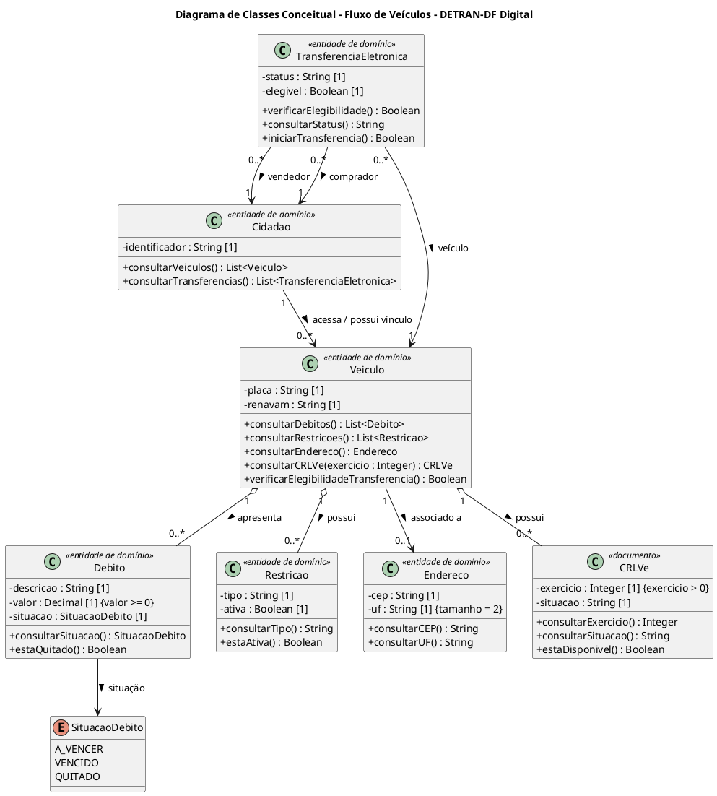

# Diagrama de Classes — Fluxo de Veículos

Os demais artefatos desta entrega estão em páginas próprias, listadas na barra lateral em **Entregas**. O levantamento que os sustenta — atores, regras, decisões e lacunas — está no [1.1.1.1. Estudo Base dos Casos de Uso](/Base/Relatorios/Subequipe_01/Yuri/1.1.1.1.EstudoBaseCasosDeUso.md).

## Diagrama de Classes

Aqui começa efetivamente a modelagem estática. O diagrama de classes deve observar classes, atributos, relacionamentos, semântica, navegabilidade e cardinalidades — e as cardinalidades merecem cuidado particular, porque alterá-las muda a interpretação e a implementação do modelo.

Como o levantamento foi feito sem acesso ao código-fonte, o que se apresenta é um **modelo conceitual de domínio**, e não uma tentativa de reconstruir as classes reais do aplicativo. Cada entidade decorre dos objetos candidatos registrados nos seis casos de uso.

  
   
  <em style="color: #666; font-size: 0.9em;">Figura 2 - Diagrama de Classes Conceitual (Fluxo de Veículos) | Elaboração: Yuri Andrade</em>

### Fonte PlantUML

### Explicação do diagrama

O modelo apresenta as principais entidades de domínio identificadas a partir dos seis casos de uso.

A classe **Cidadão** representa o usuário envolvido nos serviços. Um cidadão pode possuir acesso ou vínculo com diferentes **Veículos** no contexto observado.

O **Veículo** assume posição central no modelo, uma vez que os principais serviços dependem dele. A partir dele surgem **Débitos**, **Restrições**, **Endereço** e **CRLV-e**.

A relação entre Veículo e Débito é representada como **agregação** porque o veículo organiza a consulta dos débitos, mas o conceito de débito possui significado próprio dentro do domínio. O mesmo raciocínio foi usado para Restrição. Não foi utilizada composição, pois não existe evidência suficiente para afirmar que esses objetos só possam existir enquanto o objeto Veículo existir. A distinção é relevante porque a UML diferencia agregação e composição pela dependência de existência entre todo e parte.

**Débito** possui uma situação conceitual que pode assumir os valores *A vencer*, *Vencido* e *Quitado*, estados identificados durante o aprofundamento do fluxo de consulta.

A classe **CRLVe** representa o documento associado a determinado veículo. A multiplicidade `0..*` permite representar documentos correspondentes a diferentes exercícios.

**TransferenciaEletronica** relaciona um veículo aos papéis de vendedor e comprador. A classe possui apenas informações genéricas de situação e elegibilidade porque seu fluxo interno ainda não está completamente conhecido.

Essa última decisão é importante metodologicamente: o diagrama representa aquilo que o estudo sustenta e registra como lacuna aquilo que a engenharia reversa não conseguiu observar.

### Decisões de cardinalidade

| Relação | Cardinalidade | Justificativa |
| -- | -- | -- |
| Cidadão → Veículo | 1 para 0..* | O cidadão pode não ter veículo vinculado, ou ter vários. |
| Veículo ◇— Débito | 1 para 0..* | Um veículo regular pode não ter débito algum. |
| Veículo ◇— Restrição | 1 para 0..* | A ausência de restrição é o caso esperado. |
| Veículo — Endereço | 1 para 0..1 | Associação simples: o cadastro mantém um endereço, que o UC03 atualiza. O `0..1` evita afirmar que ele esteja sempre preenchido. |
| Veículo ◇— CRLVe | 1 para 0..* | Um documento por exercício; pode não haver nenhum emitido. |
| TransferenciaEletronica → Veículo | 0..* para 1 | Cada transferência trata de um único veículo. |
| TransferenciaEletronica → Cidadão | 0..* para 1 | Nos papéis de vendedor e de comprador, modelados como associações distintas. |

### Rastreabilidade dos casos de uso para as classes

| Caso de uso | Classes envolvidas |
| -- | -- |
| UC01 | Veículo · Débito · Restrição |
| UC02 | Veículo · Débito · Restrição · CRLVe |
| UC03 | Veículo · Endereço |
| UC04 | Veículo · Restrição · TransferenciaEletronica |
| UC05 | Veículo · Cidadão · TransferenciaEletronica |
| UC06 | Cidadão · TransferenciaEletronica |

A relação acima indica as **classes efetivamente representadas no modelo**, que não coincidem integralmente com as listas de *objetos candidatos* registradas em cada caso de uso do estudo base: nem todo objeto candidato foi promovido a classe, e o modelo agrega entidades transversais a mais de um fluxo. A divergência é deliberada e deve ser revista na consolidação da subequipe.

## Referências

SERRANO, Milene. **Arquitetura e Desenho de Software: Aula Modelagem UML Estática**. Brasília: Universidade de Brasília, [s.d.]. Material didático disponibilizado no Aprender 3.

UML-DIAGRAMS.ORG. **UML diagrams: overview of the Unified Modeling Language**. [S. l.], [s. d.]. Disponível em: https://www.uml-diagrams.org/. Acesso em: 17 set. 2026.

PLANTUML. **PlantUML — Open-source tool that uses simple textual descriptions to draw diagrams**. [S. l.], [s. d.]. Disponível em: https://plantuml.com/. Acesso em: 17 set. 2026.

## Versionamento

|Nome do Membro | Contribuição | Commit | Data |
|--|--|--|--|
| Yuri | 1. Elaboração do modelo conceitual de domínio em PlantUML | [65d23e6](https://github.com/UnBArqDsw2026-2-Turma02/2026.2-T02-_G6_ProjetoAplicativoMovel_Entrega02/commit/65d23e63254441b6067e1646a950aa2ae9680be0) | 17/09/2026 |
| Yuri | 2. Registro das decisões de cardinalidade e da rastreabilidade dos casos de uso para as classes | [65d23e6](https://github.com/UnBArqDsw2026-2-Turma02/2026.2-T02-_G6_ProjetoAplicativoMovel_Entrega02/commit/65d23e63254441b6067e1646a950aa2ae9680be0) | 17/09/2026 |
